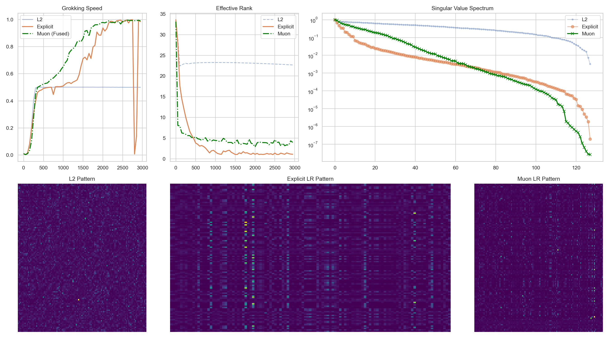

# Luon: Low-Rank Muon Optimizer 📉
### Fusing Nuclear Norm Regularization into Muon for Scale-Invariant Transformers

[](https://pytorch.org/)
[]()

> **TL;DR:** In modern LLM architectures (RMSNorm, QK-Norm), standard L2 Weight Decay fails to effectively control model complexity due to scale invariance. Zhi proposed a low-rank regularization method based on Newton-Schulz iteration, and we further fuse it into the Muon optimizer, forming **Luon (Low-rank Muon)**, achieving faster generalization on Grokking tasks.

---

## 🔥 Core Methods

This repository implements comparative experiments of three regularization strategies:

| Method | Optimizer | Low-Rank Decay Approach | Update Formula |
|--------|-----------|------------------------|----------------|
| **L2 Baseline** | AdamW | Weight Decay | $W \leftarrow W - \lambda W$ |
| **Explicit LowRank** | AdamW + Callback | Decoupled Nuclear Norm Decay | $W \leftarrow W - \alpha \cdot \text{Sign}(W)$ |
| **Luon (Fused)** | Muon | Fused Nuclear Norm Decay | $W \leftarrow W - \eta \cdot \text{NS}(\text{Momentum}(G + \lambda W))$ |

---

## 🧠 Original Motivation (Proposed by Zhi)

### L2 Decay Fails in Scale-Invariant Networks

Modern Transformers (e.g., Gemma 3, LLaMA) extensively use normalization layers. In these **scale-invariant architectures**:

$$\text{Norm}(\alpha W x) = \text{Norm}(W x)$$

L2 Weight Decay penalizes $\|W\|_F^2$, allowing the optimizer to simply shrink weights without changing functional behavior, failing to truly reduce complexity (rank).

### Solution: Nuclear Norm ($\|W\|_*$)

To control complexity in scale-invariant networks, we must control **rank** rather than magnitude. However, solving for rank is an NP-hard problem, so we consider its convex relaxation—nuclear norm regularization:

$$\mathcal{L} = \mathcal{L}_{task} + \lambda \sum_i \sigma_i(W)$$

This is equivalent to applying L1 penalty on singular values, promoting **spectral sparsity**.

### Efficient Implementation: Newton-Schulz Iteration

Computing SVD at every step is too slow. We use **Newton-Schulz iteration** to approximate the matrix sign function:

$$\text{Sign}(W) = W (W^T W)^{-1/2} \approx U V^T$$

This is the subgradient of the nuclear norm, efficiently computed using only matrix multiplications.

## What's New?

### Position of Regularization Term: Back to Adam

Early Adam added weight decay directly to the gradient, but this is mathematically incorrect—since Adam uses adaptive learning rates and momentum mechanisms, the correct approach is to **decouple** weight decay and apply it directly to the parameters themselves. This is the origin of AdamW. The Muon optimizer follows this decoupling philosophy.

However, when we use Newton-Schulz iteration to compute the subgradient of the nuclear norm, decoupling introduces efficiency issues:

| Approach | NS Computations | Description |
|----------|----------------|-------------|
| Decoupled | **2 times** | Sign(W) for regularization + Sign(momentum) for update |
| Fused | **1 time** | Sign(momentum + λW) accomplishes both simultaneously |

To avoid double computation, we propose **fusing** the nuclear norm regularization term into Muon's gradient update:

$$\text{Update} = \text{NS}\big(\text{Momentum}(G + \lambda W)\big)$$

This requires only one Newton-Schulz iteration, nearly doubling efficiency. I call this **"Back to Adam"**—the regularization term is re-integrated into the gradient, but correctly this time.

---

## 🚀 Quick Start

### Dependencies
```bash
pip install torch numpy matplotlib tqdm seaborn
```

### Run Experiment
```bash
python Luon.py --steps 3000 --device cuda
```

This will generate `mechanism_analysis_final.png`, containing:
- Grokking speed comparison
- Effective Rank evolution
- Singular value spectrum distribution
- Attention Pattern visualization



---

## 💻 Core Algorithms

### 1. Newton-Schulz Iteration

```python
def newton_schulz_robust(M, steps=5, epsilon=1e-7):
    """Compute matrix sign function: Sign(M) = M * (M^T * M)^(-1/2)"""
    M = M / (M.norm() + epsilon)  # Spectral norm normalization

    for _ in range(steps):
        A = M @ M.T
        M = 0.5 * (3.0 * I - A) @ M

    return M
```

### 2. Decoupled Nuclear Norm Decay (by Zhi)

```python
class NewtonSchulzLowRankDecay:
    def step(self):
        for W in self.params:
            sign_W = newton_schulz_robust(W.clone())
            W.sub_(self.decay_rate * sign_W)  # W <- W - α·Sign(W)
```

### 3. Luon: Fused Nuclear Norm Decay

```python
class HybridLowRankMuon(Optimizer):
    def step(self):
        # Use Muon + fused low-rank for target parameters (Q, K)
        g_fused = grad + lambda * W           # Fused gradient
        momentum.mul_(mu).add_(g_fused)       # Momentum update
        update = newton_schulz(momentum)      # Orthogonalization
        W.sub_(lr * update)                   # Parameter update

        # Use standard AdamW for other parameters
```

---

## 🧪 Experimental Setup

| Configuration | Value |
|---------------|-------|
| **Task** | Modular Addition $a + b \pmod{113}$ |
| **Architecture** | 2-layer Transformer (dim=128, heads=4) |
| **Normalization** | Pre-RMSNorm + QK-Norm |
| **Data Split** | 50% Train / 50% Validation |

---

## 📁 Project Structure

```
Luon/
├── assets/          # Assets folder
    ├── mechanism_analysis.png        # Zhi's original analysis plot
│   └── mechanism_analysis_final.png  # Analysis plot generated by Luon
├── Luon.py          # Main experiment code (self-contained)
├── experiment.py    # Zhi's original experiment script
└── README.md        # This file

```

---

## 📝 Citation

```bibtex
@misc{luon2025,
  title={Luon: Low-Rank Muon Optimizer for Scale-Invariant Transformers},
  year={2025},
  publisher={GitHub},
  howpublished={\url{https://github.com/JiaxuanZou0714/Luon}}
}
```

---

## 🔗 Related Work

- [Muon Optimizer](https://github.com/KellerJordan/Muon) - Original Muon implementation
- [Grokking](https://arxiv.org/abs/2201.02177) - Grokking phenomenon research
- [Grokking by Rank Collapse](https://github.com/Chunjiang-Intelligence/low-rank-decay) - Zhi's original implementation

---

*This is a research prototype.*
