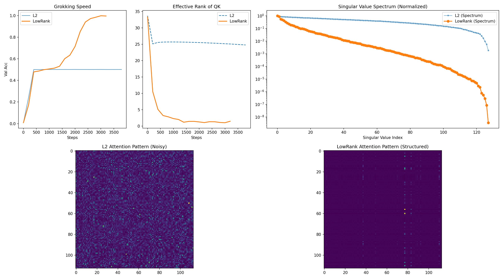

# Grokking by Rank Collapse 📉
### Nuclear Norm Regularization as a Complexity Prior for Scale-Invariant Transformers

[](https://pytorch.org/)
[]()

> **TL;DR:** In modern LLM architectures (RMSNorm, QK-Norm), standard Weight Decay (L2) fails to control model complexity due to scale invariance. We introduce **Low-Rank Decay**, an efficient Nuclear Norm regularization technique using Newton-Schulz iteration (no SVD required). It aggressively prunes the "memorization circuit," forcing **Rank Collapse** and accelerating **Grokking** by orders of magnitude.

---

## 🔥 Key Results

### 1. The Phase Diagram of Generalization
**Low-Rank Decay significantly expands the grokking region.**
While L2 decay fails to generalize in data-scarce regimes (40%-50% data), Low-Rank Decay successfully forces the model to learn the algorithm, achieving perfect accuracy.



### 2. The Mechanism: Rank Collapse
**Rank collapse is a pre-condition for generalization.**
Our method induces a spectral phase transition (orange line) within the first 500 steps, reducing the effective rank of QK matrices to near-unity. This creates a low-dimensional manifold that facilitates learning the structured solution.


---

## 🧠 The Motivation

### The Failure of L2 Decay
Modern Transformers (e.g., Gemma 3, LLaMA) are heavily normalized (RMSNorm, QK-Norm). In these **Scale-Invariant Architectures**, scaling the weight matrix $W$ by a constant $\alpha$ does not change the model's output:
$\text{Norm}(\alpha W x) = \text{Norm}(W x)$
However, standard L2 Weight Decay penalizes the magnitude $\|W\|_F^2$. This means the optimizer can satisfy the regularization simply by shrinking weights without changing the function or reducing the actual complexity (Rank).

### The Solution: Nuclear Norm ($\|W\|_*$)
To control complexity in a scale-invariant network, we must control the **Rank**, not the Magnitude. We apply Nuclear Norm Regularization:
$\mathcal{L} = \mathcal{L}_{task} + \lambda \sum \sigma_i(W)$
This acts as an L1 norm on the singular values, promoting **Spectral Sparsity**.

### The Trick: Newton-Schulz Iteration
Computing SVD at every step is too slow. We use **Newton-Schulz iteration** to approximate the sign of the matrix ($\text{sign}(W) = U V^T$), which is the gradient of the Nuclear Norm. This allows us to apply Low-Rank Decay with the efficiency of matrix multiplication.

---

## 🚀 Quick Start

This repository is self-contained in a single file for reproducibility.

### Requirements
```bash
pip install torch numpy matplotlib tqdm seaborn
```

### 1. Reproduce Mechanism Analysis (Fast)
To see the **Rank Collapse** and **Attention Patterns** (generating the mechanism plot):
```bash
python experiment.py --mode mechanism
```

### 2. Reproduce Phase Diagram (Slow)
To run the grid search over data fractions and decay strengths:
```bash
python experiment.py --mode phase_diagram
```

---

## 💻 Algorithm Implementation

The core logic is decoupled from the optimizer, making it easy to plug into existing training loops (e.g., HF Trainer).

```python
class NewtonSchulzLowRankDecay:
    def step(self):
        for W in self.params:
            # 1. Normalize Spectral Norm
            X = W / (W.norm() + 1e-8)
            
            # 2. Newton-Schulz Iteration (Approximate UV^T)
            # Y_{k+1} = 0.5 * Y_k * (3I - Y_k^T * Y_k)
            Y = X
            for _ in range(5):
                A = Y.T @ Y
                Y = 0.5 * Y @ (3.0 * torch.eye(...) - A)
            
            # 3. Apply Update
            # W <- W - lambda * sign(W)
            W.sub_(self.decay_rate * Y)
```

---

## 🧪 Experimental Setup

*   **Task:** Modular Addition ($a + b \pmod P$)
*   **Architecture:** Scale-Invariant Transformer (Pre-RMSNorm + **QK-Norm**)
*   **Baselines:** 
    *   AdamW + L2 Decay (Standard)
    *   AdamW + Low-Rank Decay (Ours)

---

## 📝 Citation

If you find this useful for your research on Grokking, Mechanistic Interpretability, or LLM Optimization, please cite:

```bibtex
@misc{lowrank2025,
  title={Grokking by Rank Collapse: Nuclear Norm Regularization as a Complexity Prior},
  year={2025},
  publisher={GitHub},
  howpublished={\url{https://github.com/Chunjiang-Intelligence/low-rank-decay/}}
}
```

---

*This is a research prototype.*
